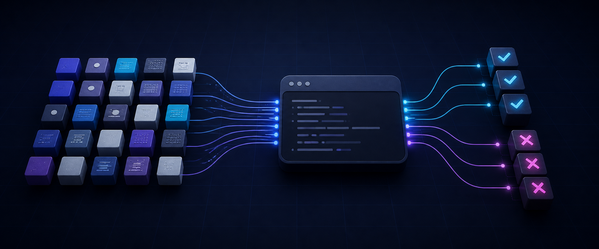
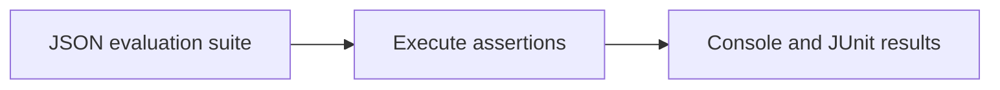

<!-- readme-refresh:start -->
<p align="center">
  <picture>
    <source media="(prefers-color-scheme: dark)" srcset="assets/readme-banner.png">
    <source media="(prefers-color-scheme: light)" srcset="assets/readme-banner.png">
    
  </picture>
</p>

<h1 align="center">🧪 EvalCase</h1>

<p align="center"><strong>Run provider-neutral regression checks for agents and command-line tools.</strong></p>

<p align="center">
  <a href="https://github.com/al1re3a/evalcase/actions/workflows/ci.yml"></a>
  <a href="https://www.python.org/"></a>
  <a href="LICENSE"></a>
  <a href="https://github.com/al1re3a/evalcase/stargazers"></a>
  <a href="https://github.com/al1re3a/evalcase/issues"></a>
</p>

<p align="center">
  <a href="https://github.com/al1re3a/evalcase"></a>
  <a href="CONTRIBUTING.md"></a>
  <a href="SECURITY.md"></a>
</p>

<p align="center">
  
</p>

> [!NOTE]
> EvalCase evaluates observable command behavior; it does not claim to measure every aspect of model quality.

## 📑 Contents

- [At a glance](#-at-a-glance)
- [Why](#why)
- [Assertions](#assertions)
- [CI-ready reports](#ci-ready-reports)
- [Design](#design)
- [Development](#development)

---

## 🔎 At a glance

| | |
|---|---|
| **Purpose** | Provider-neutral regression tests for AI agents and CLI tools with JSON suites and JUnit output. |
| **Input** | JSON evaluation suite |
| **Output** | Console and JUnit results |
| **Runtime** | Python 3.10+ |
| **CI** | ✅ Linux · Windows |
| **Status** | ✅ Maintained |

<details>
<summary><strong>🧭 How it works</strong></summary>



</details>

<details>
<summary><strong>📁 Repository layout</strong></summary>

```text
evalcase/
├── .github/
├── src/
├── tests/
├── examples/
├── pyproject.toml
└── README.md
```

</details>

<details>
<summary><strong>🤝 Contributors</strong></summary>

<br>
<a href="https://github.com/al1re3a/evalcase/graphs/contributors">
  
</a>

</details>
<!-- readme-refresh:end -->

**Regression-test any agent through the CLI it already has.**

EvalCase is a tiny, provider-neutral runner for deterministic AI and agent evaluations. It sends each case to a command on stdin and checks exact text, substrings, regexes, exit codes, and nested JSON fields.

```bash
evalcase examples/cases.json -- python examples/echo_agent.py
```

## Why

Agent frameworks change quickly; your behavioral contract should not. EvalCase uses a plain JSON suite and any executable adapter, so the same cases can test a local model, hosted provider, RAG pipeline, or traditional CLI.

## Assertions

```json
{
  "name": "structured answer",
  "input": "Return service status",
  "assert": {
    "exit_code": 0,
    "contains": ["healthy"],
    "not_contains": ["password"],
    "regex": ["latency_ms"],
    "json": {"status": "ok", "metrics.latency_ms": 42}
  }
}
```

## CI-ready reports

```bash
evalcase cases.json --jobs 4 --timeout 60 --format json -- my-agent --json
evalcase cases.json --format junit --output eval-results/junit.xml -- my-agent
```

Commands are executed directly with `shell=False`; user input is sent over stdin rather than interpolated into a shell command.

## Design

- Zero runtime dependencies
- Parallel cases with stable input ordering
- Useful timeout and assertion failures
- No provider SDK or API-key convention
- JSON and JUnit output for CI

## Development

```bash
python -m unittest discover -s tests -v
```

## License

MIT
